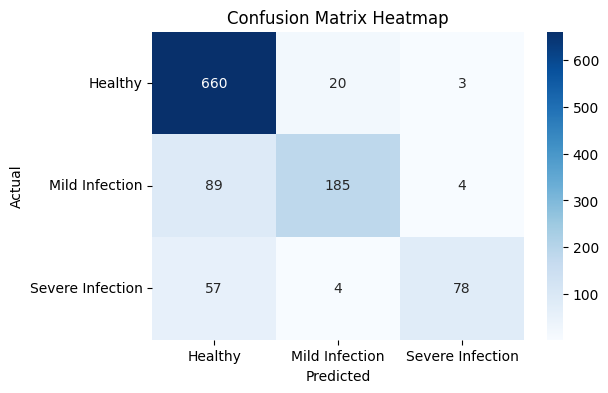

# Plant Disease Detection using Machine Learning

## Overview
This project predicts plant disease status using structured plant features such as leaf color, humidity, temperature, and leaf spot size.

Instead of using image-based methods, the model uses **tabular agricultural data** to classify whether a plant is diseased or healthy. This approach demonstrates how machine learning can detect patterns in plant characteristics and assist in early disease diagnosis.

---

## Dataset

The dataset consists of plant observations stored in CSV files.

Each row represents a plant instance with features describing plant characteristics and environmental conditions.

### Example Features

| Feature | Description |
|------|------|
| Plant_Type | Type of plant |
| Leaf_Color | Color of plant leaves |
| Leaf_Spot_Size | Size of spots present on leaves |
| Humidity | Environmental humidity |
| Temperature | Environmental temperature |
| Disease_Status | Target label indicating disease presence |

Two datasets were combined to create the final training dataset.

---

## Machine Learning Pipeline

### 1. Data Loading
Two CSV datasets are loaded and merged using pandas.

### 2. Exploratory Data Analysis (EDA)
Visualization techniques are used to understand the dataset:

- Plant type distribution
- Disease status distribution
- Boxplots for feature comparison
- Correlation analysis for numeric features

Libraries used:
- Matplotlib
- Seaborn

---

### 3. Data Preprocessing

Categorical features are encoded using **LabelEncoder**:

- Plant_Type
- Leaf_Color
- Disease_Status

---

### 4. Train-Test Split

The dataset is split into training and testing sets using:

train_test_split(test_size=0.2, stratify=y)

This ensures balanced representation of disease classes.

---

### 5. Model Training

A **Random Forest Classifier** is used for training.

Reasons for choosing Random Forest:

- Works well for tabular datasets
- Handles nonlinear relationships
- Provides feature importance insights

---

### 6. Model Evaluation

Model performance is evaluated using:

- **Classification Report**
- **Confusion Matrix**
- **Feature Importance Visualization**

Metrics include:

- Precision
- Recall
- F1-score

confusion Matrix: 
---

### 7. Feature Importance

Random Forest provides feature importance scores that show which plant characteristics contribute most to disease prediction.

---

### 8. Model Saving

The trained model and encoders are saved using **joblib**:

plant_disease_model.pkl
plant_encoder.pkl
color_encoder.pkl
status_encoder.pkl

This allows the model to be reused without retraining.

---

## Project Structure

Plant-Disease-Detection
│
├── dataset/
│ plant_disease.csv
│
├── notebook/
│ plant_disease_detection.ipynb
│
├── README.md
└── requirements.txt

---

## How to Run

Install dependencies:

pip install -r requirements.txt

Open the notebook:

notebook/plant_disease_detection.ipynb

Run all cells to train and evaluate the model.

---

## Technologies Used

- Python
- Pandas
- NumPy
- Scikit-learn
- Matplotlib
- Seaborn
- Joblib

---

## Future Improvements

Possible improvements include:

- Adding more plant features for better prediction
- Hyperparameter tuning
- Deploying the model as a web or mobile application
- Integrating image-based detection with structured data

---

## Author

Ashutosh Dubey  
B.Tech: 3rd-Information Technology

